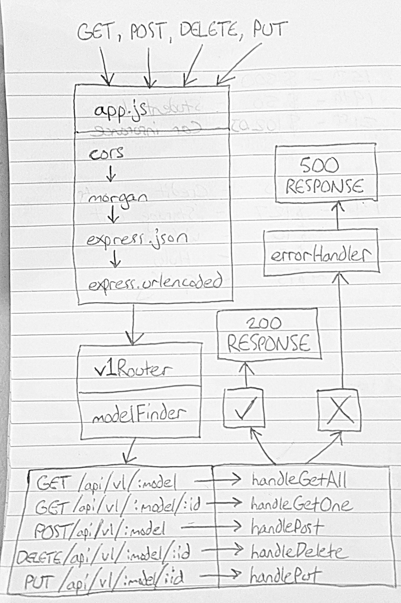

# LAB - 09

## API Server

### Author: Austin Hedeen

### Links and Resources
* [submission PR](https://github.com/austinhedeen-401-advanced-javascript/lab-09/pull/1)
* [travis](http://xyz.com)
* [back-end](https://murmuring-brook-43876.herokuapp.com/)

#### Documentation
* [api docs](https://murmuring-brook-43876.herokuapp.com/api-docs)
* [jsdoc](https://murmuring-brook-43876.herokuapp.com/docs/)

### Modules
#### `app.js`
##### Exported Values and Methods

###### `server`
The Express application (for testing)

###### `start(port)`
Starts the Express server on `port`

### Setup
#### `.env` requirements
* `PORT` - Port Number
* `MONGODB_URI` - URL to the running mongo instance/db

#### Running the app
* `npm start`
* Endpoint: `/api-docs`
  * Renders API Documentation
* Endpoint: `/docs`
  * Renders Developer Documentation
* Endpoint: `/api/v1/:model/`
  * GET: Fetch all Model records
  * POST: Create a Model record
* Endpoint: `/api/v1/:model/:id`
  * GET: Fetch a Model record
  * PUT: Update a Model record
  * DELETE: Delete a Model record
  
#### Tests
* `npm test`

#### UML

